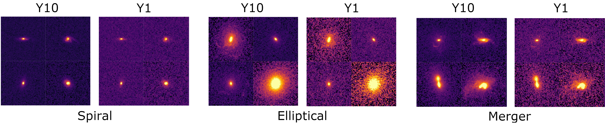

# DeepAdversaries
This repository includes code for studying robustness of deep learning algorithms to adversarial attacks that may naturally arise from scientific data pipelines, such as the Vera C. Rubin Observatory’s Legacy Survey of Space and Time (LSST). We study the problem within the context of galaxy morphology - distinguishing between spiral, elliptical and merging galaxies.  

### About
Deep learning models have already proven to be important when working with very large, high-dimentional scientific  datasets,  like  those  from  current  and  future  large-scale  astronomical  surveys. High complexity and overparametrization of deep learning models makes them brittle and prone to many kinds of cleverly designed adversarial attacks. Their performance can substantially degrade even due to perturbations from image compression or blurring, which can naturally occur in real scientific data.  It is crucial to understandthis brittleness and develop models robust to these adversarial perturbations. Here we study how performance degrades when two datasets have different levels of noise (one year vs. ten years of observations), as well as how perturbations of one-pixel (as a proxy for compression or telescope errors) influences model performance. Furthermore,  we  study  if  domain  adaptation, which help bridge the gap between datasets from different domains (like simulated and real data, or observations from two telescopes), can also help improve model robustness and increase model stability when it comes to these naturally occuring "attacks".

### Architecture
Our experiments were performed using a simple CNN architecture we call ConvNet, as well as using a more complex and well known ResNet18 network. After convolutional layer which extract important features from images, both networks include the same 256-dimentional bottlneck layer and an output layer with 3 neurons. We want to comapere behaviour of the two networks, and in order to do that we enforce the same size of the latent space they create (256). 

### Datasets
We produce LSST mock data of galaxy morphology using simulated  data from the final two snapshots of Illustris TNG100, by adding noise and PSF using GalSim package. The images used can be found at [Zenodo](https://doi.org/10.5281/zenodo.5514180). 


<div align="center">
<sub>Example mock images of spiral (left), elliptical (middle) and merging galaxies (right) after one (Y1) and ten (Y10) of LSST observations.</sub>
</div>

### Plotting the latent data distribution
We  explore  different  methods  to  visualize  how one-pixel attacks and observational noise from exposure time functioned to perturb a base galaxy image  in  the latent  space.  
- Church window plots derive their name from a colorful representation of latent space around a given input example that resembles panes of stained glass. These colors map onto the potential classes available for classification. This provides information on how a given perturbation in latent space affects the classification of a particular example image.
- Isomaps seek a lower-dimensional  embedding of the latent space of the network which maintains geodesic distances between points, thus more realistically showing distances present in theoriginal multi-dimensional space.
- 

<div align="center">
<sub>Example church window plots (left) and isomaps (right) for model trained without (top) and with domain adaptation (bottom). </sub>
</div>

### Training
Explanations of how to run different versions of training, evaluation as well as plotting of isomaps and church window plots are given in example notebook: 
```
adversarial_studies.ipynb 
```

### Requirements
This code was developed using Pytorch xxx. The requirements.txt file lists all Python libraries that your notebooks will need, and they can be installed using:
```
pip install -r requirements.txt
```

### Authors
- Aleksandra Ćiprijanović
- Diana Kafkes

### References
If you use this code, please cite our paper: [arXiv:xxxxx](https://arxiv.org/abs/xxxxxx)
